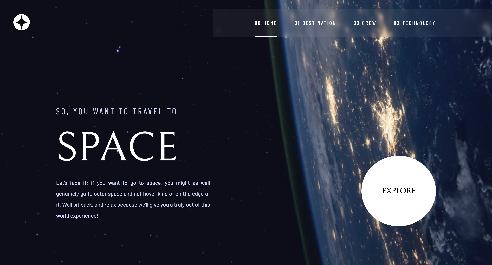

# Space Tourism Website

React-based space tourism website that features a dynamic experience.

The website allows users to view the optimal layout for each of the website's pages depending on their device's screen size, see hover states for all interactive elements on the page and view each page and be able to toggle between the tabs to see new information.

## Built With

- JavaScript
- React.js
- HTML5
- CSS3

## Live Demo

[Live Demo Link](https://space-tourism-react-project.netlify.app/)

## Getting Started

**This is an example of how you may give instructions on setting up your project locally.**
**Modify this file to match your project, remove sections that don't apply. For example: delete the testing section if the currect project doesn't require testing.**

To get a local copy up and running follow these simple example steps.

### Prerequisites

* You need npm to be installed on your local machine. For details please use the following site: 
https://docs.npmjs.com/downloading-and-installing-node-js-and-npm

### Setup

* Next you need to clone the repository on your local machine with the following command line:
git clone https://github.com/MarijaBute/space-tourism-app.git

### Install

* To install the project you need to enter the directory you've cloned. Open a terminal and follow these next steps:
* npm install (to install all the necessary modules and dependencies)

### Usage

* To run this project localy simply run the following line:

npm start;

* And the project should be deployed on your machine and you can access it on a browser by default on the URL: localhost:3000

## Authors

- Verica Mitreva
- Marija Buteska

👤 **Author1**

- GitHub: [@githubhandle](https://github.com/vericamitreva)
- LinkedIn: [LinkedIn](https://www.linkedin.com/in/vericamitreva)

👤 **Author2**

- GitHub: [@githubhandle](https://github.com/MarijaBute)
- LinkedIn: [LinkedIn](https://www.linkedin.com/in/marija-buteska-458a34263/)

## 🤝 Contributing

Contributions, issues, and feature requests are welcome!

Feel free to check the [issues page](issues/).

## Show your support

Give a ⭐️ if you like this project!

## Acknowledgments

- https://www.frontendmentor.io/

## 📝 License

This project is [MIT](lic.url) licensed.